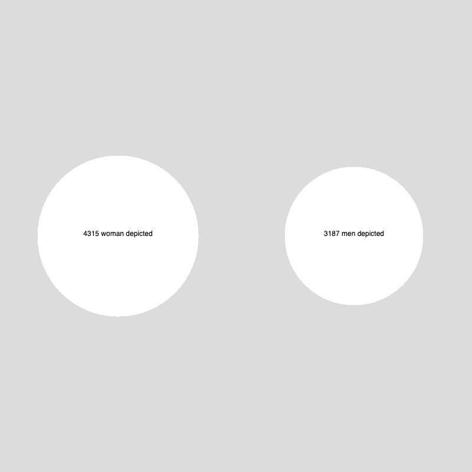

# Example 

## Interesse

- Erster Ansatz: Wie sieht die Verteilung zwischen Männlichen und Weiblichen Künstler:innen in der Sammlung aus? Die Hypothese ist, dass Männer überrepräsentiert sind. 
- Zweiter Ansatz (nachträglich): Wie ist die Verteilung der Darstellung von Frauen und Männern in den Objekten?

## Daten Entdecken

Wie kriege ich Kunstwerke welche von Frauen bzw. Männern erarbeitet wurden? Ist diese Information überhaupt in den Daten vorhanden? 

In der [Dokumentation](https://developers.vam.ac.uk/guide/v2/filter/introduction.html#filter-by-category) habe ich gelesen, dass man Objekte nach Kategorie filtern kann. Diese Kategorien haben einen Identifier, z.b. `THES49002` bezieht sich auf `'Gardens & Gardening'`. Aber wie erhalte ich eine Übersicht aller verfügbaren Kategorien? In der [Dokumentation](https://developers.vam.ac.uk/guide/v2/common-identifiers.html) steht ebenfalls, dass die Identifier auf dem [Getty](https://www.getty.edu/research/tools/vocabularies/) Vokabular basieren, aber leider konnte ich so nicht den richtigen Identifier rekonstruieren.

Als erster Versuch habe ich deshalb einfach alle Objekte nach dem Begriff "Women" durchsucht (`https://api.vam.ac.uk/v2/objects/search?q=Woman`). Das wahr super! Im Response gibt es die Property `clusters` welche wiederum `category` enthalt. Darin habe ich bei den `terms` die Kategorie `Woman Artists` mit der ID `THES387590` gefunden.

```js
let woman_artist = "THES387590"
let woman_query = "https://api.vam.ac.uk/v2/objects/search?id_category=" + woman_artist;

d3.json(woman_query).then(json => {
    women_data = json;
    console.log("Woman", women_data)
})
```

Ich habe anschliessen das gleiche Vorgehen für die Männer angewendent, leider gibt es wirklich viel mehr Einträge zu Männern und ich konnte die ID zu `Men Artist` nicht finden (sollte sie den existieren). 

Als zweiten Versuch habe ich direkt nach einem Künstler gesucht um zu sehen ob ich so zur Kategorie komme (`'https://api.vam.ac.uk/v2/objects/search?q_actor=william morris'`) was aber leider auch nicht funktioniert hat. 

Als dritten Versuch habe ich die Kategorien selbst ausgegeben: `https://api.vam.ac.uk/v2/objects/clusters/category/search?cluster_size=100`, leider war hier unter den ersten 100 auch kein term `Men Artist`. 

Nach einer letzten Suche über die Webseite des V&A nach der Kategorie `Woman Artist` ([Link](https://collections.vam.ac.uk/search/?id_category=THES387590)) und den Begriff `Men Artist` ([Link](https://collections.vam.ac.uk/search/?q=men%20artist&page=1&page_size=15)) muss ich annehmen, dass es die Kategorie `Men Artist` nicht gibt (was an und für sich bereits spannend ist).

## Daten Definieren

Da es keine Kategorie `Men Artist` gibt und dadurch ein Vergleich mit `Woman Artist` nicht möglich ist, habe ich mich entschieden zu untersuchen wie oft Männer bzw. Frauen in Objekten dargestellt werden. Dazu existiert die Property [`depiction`](https://developers.vam.ac.uk/guide/v2/filter/introduction.html#filter-by-depiction). Hier war das [Beispiel](https://developers.vam.ac.uk/guide/v2/data-vis/clustering.html) mit dem Clustering hilfreich um auf die ID's zu kommen. 

Die ID für `woman` ist `AAT25943` und für `men` `AAT25928`. Die Queries sind wie folgt: 

```js
let woman_depicted = "https://api.vam.ac.uk/v2/objects/search?id_depicts=AAT25943";
let men_depicted = "https://api.vam.ac.uk/v2/objects/search?id_depicts=AAT25928"
```

## Daten Visualisieren

Ich habe zwei einfache Kreise gezeichnet und dazu die D3 Funktion `d3.scaleSqrt()` genutzt.



## Interpretation & Erkenntniss

Während ich beim ersten Ansatz davon ausgegangen bin mehr Objekte von männlichen Künstlern zu finden ist es bei der Darstellung umgekehrt. Erkennt man hier eine Objektifizierung der Frau in der Kunst? Zu diesem Zeitpunkt wäre das wohl eine gewagte These. Es wäre aber spannend nun in einem zweiten Schritt weitere Daten für den Vergleich einzubauen. Mit welchen weiteren Kategorien sind bspw. abgebildete Männer und Frauen versehen?